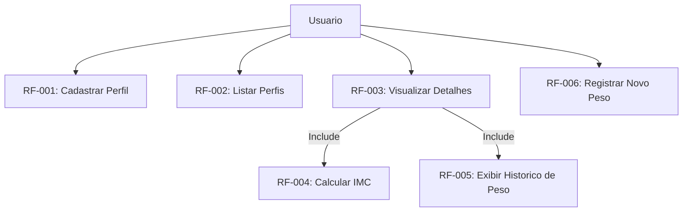
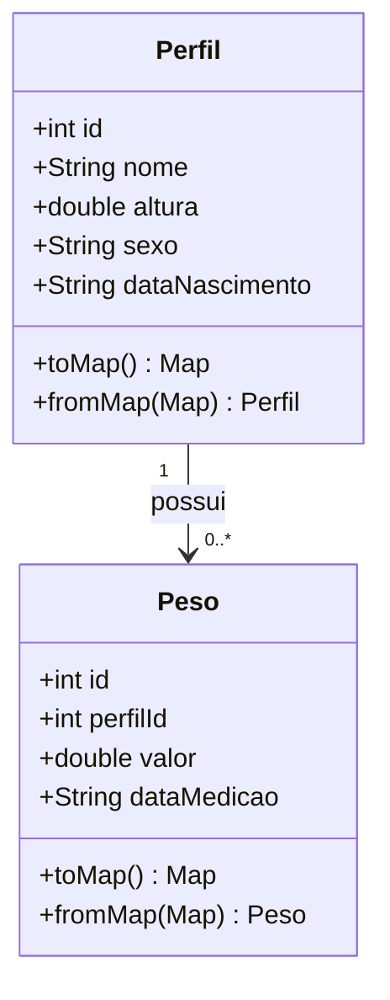
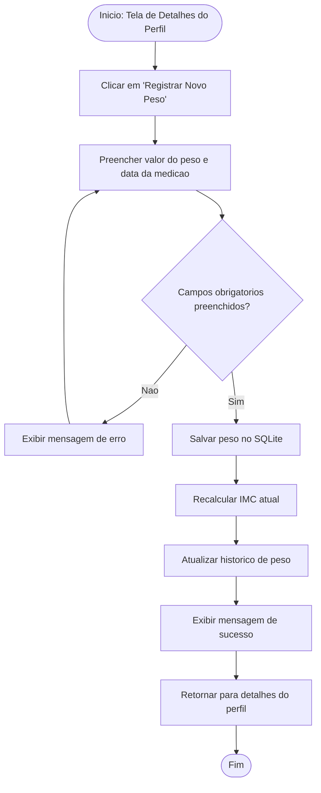

# Documentacao de Requisitos de Software (DRS / SDR) - Calculadora de IMC e Historico de Peso

**Padrao de Referencia:** ISO/IEC/IEEE 29148:2018

**Versao:** 1.0

---

## 1. Introducao

### 1.1 Finalidade

Este documento especifica os requisitos do aplicativo movel de Calculadora de IMC e Historico de Peso. O sistema utiliza Flutter para a interface e SQLite para a persistencia local dos dados.

### 1.2 Escopo do Sistema

O aplicativo destina-se ao cadastro de perfis de usuarios e ao acompanhamento do peso ao longo do tempo. Ele permite registrar dados basicos do perfil, visualizar o IMC atual e consultar o historico de medicoes de peso.

- **O que esta no escopo:** Cadastro de perfil, listagem de perfis, visualizacao de detalhes, calculo de IMC, historico de peso e persistencia local em SQLite.
- **O que esta fora de escopo:** Login de usuarios, sincronizacao em nuvem, recomendacoes medicas, dietas, treinos e integracao com dispositivos externos.

---

## 2. Descricao Geral

### 2.1 Perspectiva do Produto

O produto funciona de forma autonoma em dispositivos moveis, sem depender de internet para suas funcoes principais. A organizacao do projeto pode seguir camadas simples, como model, controller e view.

### 2.2 Funcoes do Produto

- Manter o cadastro de perfis.
- Listar perfis cadastrados.
- Exibir detalhes do perfil selecionado.
- Calcular e exibir o IMC atual.
- Registrar novos pesos para o perfil.
- Exibir grafico ou lista do historico de peso.

### 2.3 Classes e Caracteristicas dos Usuarios

- **Usuario comum:** Pessoa que deseja acompanhar seu IMC e seu historico de peso de forma simples.

---

## 3. Requisitos do Sistema

### 3.1 Requisitos Funcionais (RF)

| Identificador | Requisito                | Descricao                                                                                                             | Prioridade |
| ------------- | ------------------------ | --------------------------------------------------------------------------------------------------------------------- | ---------- |
| **RF-001**    | Cadastrar Perfil         | O sistema deve permitir o cadastro de um perfil contendo: nome, altura, sexo e data de nascimento.                    | Essencial  |
| **RF-002**    | Listar Perfis            | O sistema deve exibir uma lista com os perfis cadastrados.                                                            | Essencial  |
| **RF-003**    | Visualizar Detalhes      | O sistema deve exibir os detalhes do perfil selecionado, incluindo altura e IMC atual.                                | Essencial  |
| **RF-004**    | Calcular IMC             | O sistema deve calcular o IMC com base na altura do perfil e no peso mais recente registrado.                         | Essencial  |
| **RF-005**    | Exibir Historico de Peso | O sistema deve exibir um grafico ou lista com o historico de peso do perfil selecionado.                              | Essencial  |
| **RF-006**    | Registrar Novo Peso      | Para o perfil selecionado, o sistema deve permitir registrar um novo peso informando valor do peso e data da medicao. | Essencial  |
| **RF-007**    | Persistencia Local       | O sistema deve salvar os registros no banco de dados SQLite do aparelho.                                              | Essencial  |

### 3.2 Requisitos Nao-Funcionais (RNF)

| Identificador | Requisito       | Descricao                                                                       | Categoria        |
| ------------- | --------------- | ------------------------------------------------------------------------------- | ---------------- |
| **RNF-001**   | Portabilidade   | O aplicativo deve rodar em dispositivos Android compativeis com Flutter.        | Portabilidade    |
| **RNF-002**   | Desempenho      | A listagem, os detalhes e o historico de peso devem carregar em ate 2 segundos. | Eficiencia       |
| **RNF-003**   | Disponibilidade | O aplicativo deve funcionar offline.                                            | Confiabilidade   |
| **RNF-004**   | Arquitetura     | O codigo-fonte deve manter separacao simples entre models, controllers e views. | Manutenibilidade |

---

## 4. Diagramas de Engenharia de Software

### 4.1 Diagrama de Casos de Uso

Mostra o comportamento do sistema na perspectiva do usuario.

### 4.2 Diagrama de Classes

Demonstra as principais entidades do sistema e o relacionamento entre elas.

### 4.3 Diagrama de Fluxo (Registro de Novo Peso)

Ilustra o fluxo para registrar uma nova medicao de peso.

---

## 5. Analise de Risco

| Risco                    | Impacto | Mitigacao                                                               |
| ------------------------ | ------- | ----------------------------------------------------------------------- |
| Perda de dados locais    | Alto    | Utilizar SQLite corretamente e evitar apagar registros sem confirmacao. |
| Cadastro incompleto      | Medio   | Validar campos obrigatorios antes de salvar.                            |
| Calculo incorreto do IMC | Alto    | Validar altura e peso antes de calcular.                                |

---

## 6. Controle de Versoes

| Versao | Data       | Descricao                                   |
| ------ | ---------- | ------------------------------------------- |
| 1.0    | 11/06/2026 | Criacao da documentacao inicial do sistema. |